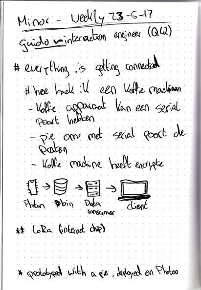

# Weekly nerd 11-4-17

> Guido Bouwman _interaction engineer (Q42)_
> About hacking your coffee machine

## Everything is getting connected

### hoe hack ik een koffie machine
- koffie apparaat kan een serial port hebben
- pie om met serial port te praten
- koffie machine heeft encryptie

_** LoRa (internet chip)_
_* Prototyped with a pie, deployed on a Photon_

