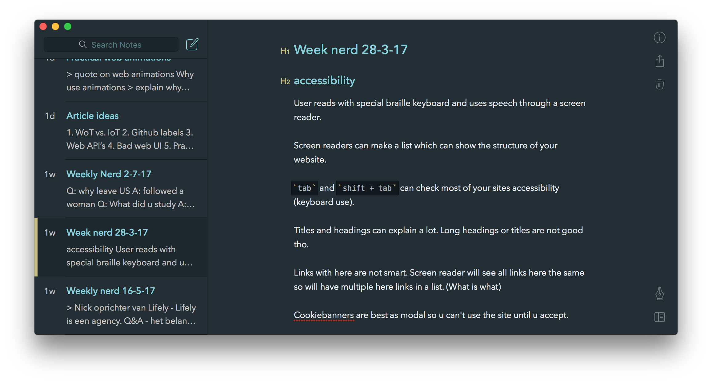

# Week nerd 28-3-17

> Bram Duvigneau
> About being a blind developer

## accessibility
User reads with special braille keyboard and uses speech through a screen reader.

Screen readers can make a list which can show the structure of your website.

`tab` and `shift + tab` can check most of your sites accessibility (keyboard use).

Titles and headings can explain a lot. Long headings or titles are not good tho.

Links with here are not smart. Screen reader will see all links here the same so will have multiple here links in a list. (What is what)

Cookiebanners are best as modal so u can't use the site until u accept.

"Hidding screen reader elements"

Use `<td>` and `<th>` in your tables.

_Tool: ase accessibility_

