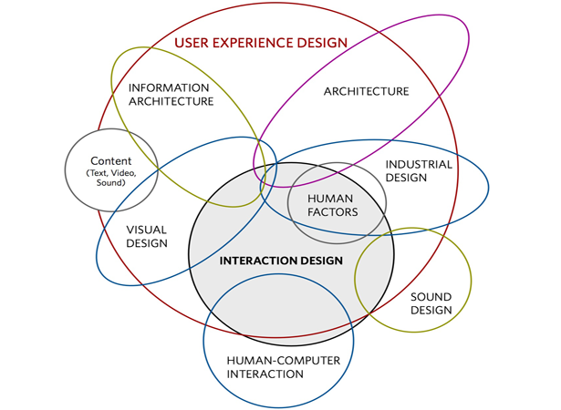
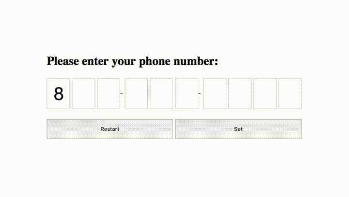
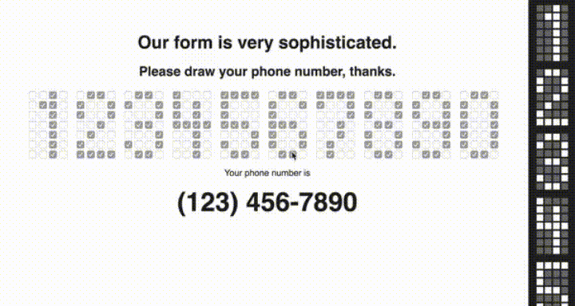
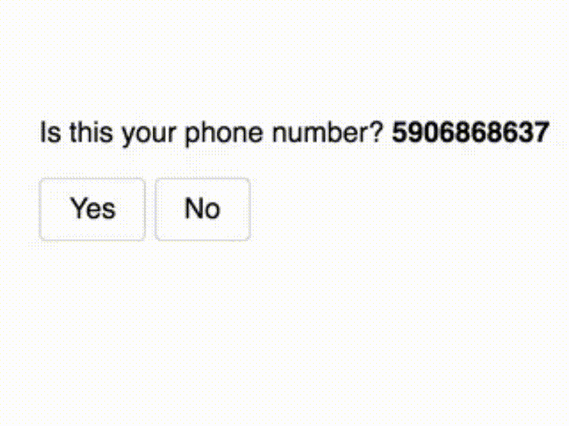
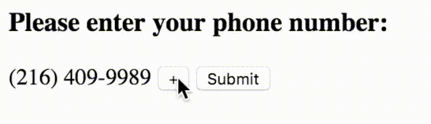
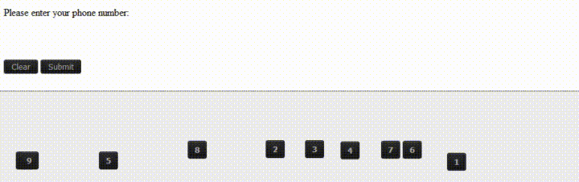

# Bad web UX
> How do you know if something is pretty? The easiest way is to put something really ugly next to it for comparison. That might seem harsh but honestly that is the type of environment the web is. People navigate to so many sites that a badly designed one sticks out just as much as one that is great to look at. ~ _Lounge Lizard / October 22nd, 2012_

The same goes for user experience (UX) of a website. Experiencing bad web UX design sticks out, just as well as good web UX. But experiencing bad web UX will steer users away from your website.

In the next part of this article I will be explaining what is considered bad web UX so that you can make sure user stay at your sites.

## What is web UX
Simply explained UX is the feeling you get being able to ride a bicycle. Now to take this to a more web defined perspective, the User Experience is how they feel when they look at the site, which could also be seen as the broad scope.

> Good user experience is the art of a drill going through wood, or a surfboard gliding through water effortlessly. The feelings those give you is unparalleled because they just work, simple as that. Though, in contrast, the shape of that board that helps it make those turns on the wave is good user interface (UI), and the surf wax on the top so you don’t slip off is also good UI. In short, the ENTIRE package is what makes it good UX, whereas good UI is always a very important inner-element of that. ~ _Dain Miller / explaining UX_

_[O Danny Boy | Interaction designer and author Dan Saffer](http://www.odannyboy.com/)_

For a further explanation of UX here is a good read on it, [Seriously though, what is UX design really?](https://thenextweb.com/dd/2016/08/11/what-the-hell-is-ux-design/#.tnw_MeiaOO7X).

## Examples of bad web UX
For the next examples I’m going to use a phone number input field. As the pictures will show the user has to do way to much tasks, which gives the user a bad feeling. And the result is bad UX.

Source: [If Satan was a web developer - Album on Imgur](http://imgur.com/gallery/qA4Bu)

## Conclusion
The most important takeaway here is to realize why something doesn’t work. The next time you frown at an instance of bad UX, stop to think. Understand why the design failed, find examples of UX that did this right, and make a mental note of why this works.
