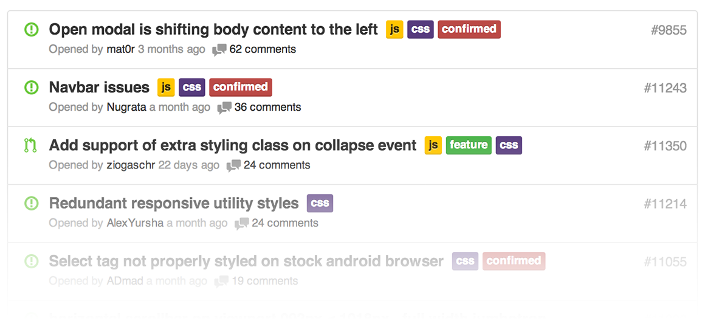
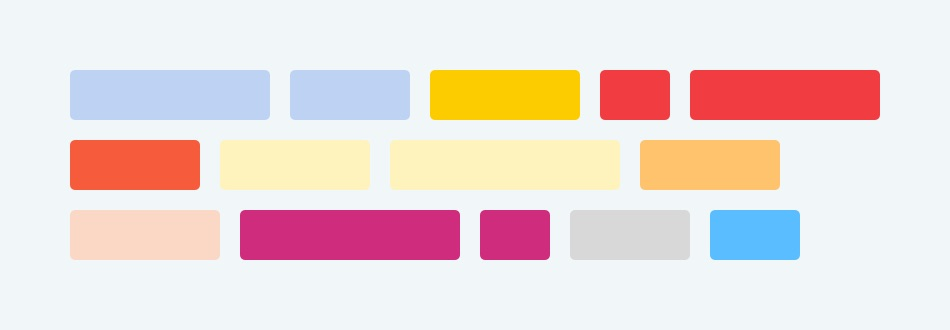

# Github labels
## What are github labels?

_Source: [Mastering Issues · GitHub Guides](https://guides.github.com/features/issues/)_

Every GitHub repository starts with them, a baseline set of labels. They cover common scenarios and should make it easy to navigate even unfamiliar repositories. Most (if not all) active issue trackers keep and use native labels.

As the more and more issues get opened, native sets start to show its limits and lack of nuance. It becomes hard to distinguish the state of the issue and next steps or blockers on the path to its resolution.

## Why use labels?
Here are some points as to why labels can be useful:
* Issue labelling is a process tool. A well-implemented process tool augments your work by improving communication, feature prioritization and use of time.
* Great open source projects use labels to organize their issue trackers for navigation, assign and track work and prioritize features.
* Great open source projects also use labels to attract new community members by clearly marking where they should start.
* Well-labeled issues make open source easier. Use them.

## What labels to use
Labels should relate only to the process of the project, not the content. For example, labelling an issue with ‘Module A’ only helps if your team divides up work by module.

Before you go change all the labels, think about how your team works and how your project is organized. Here are some questions to consider:
* What kind of tickets _(bug reports, feature requests, work trackers, etc.)_ are allowed on the issues tracker?
* What stages (bug confirmation, issue assignment, PR review, etc.) does each type of ticket have to pass from start to finish?
* What outputs (code, tests, documentation, etc.) do we create as we completely resolve each type of ticket?
* What type of release is this going to concern (major, minor, patch) when the ticket is finished.
* Does our core team divide up work by particular pieces of the code base?

Answering those questions should draw out most labels needed within a project. Start with the more obvious labels and build on them over time. As you ‘test’ these labels, pay attention to the use of them and adjust your labels accordingly. This means both creating new labels (e.g., creating a ‘Module A’ label because you started dividing up work by modules) and deleting less used ones (e.g., removing the ’Major Bomb’ label because you thought this could come in handy, but it didn’t).

## Example of labels

_**This is an example; try to find which ones work for your project**_
Group        | ----------- | ------------------- | ------------- | ----------------- |
------------ | ----------- | ------------------- | ------------- | ----------------- |
Problems     | bugs        | security            |               |                   |
Mindless     | chore       | refactor            | documentation |                   |
Experience   | design      | ux                  | affordance    | styling           |
Environment  | production  | staging             | test          |                   |
Feedback     | question    | request for comment | discussion    |                   |
Improvements | enhancement | optimization        |               |                   |
Additions    | feature     |                     |               |                   |
Pending      | in progress | watchlist           |               |                   |
Inactive     | wont fix    | on hold             | invalid       | duplicate         |
Help Wanted  | help wanted |                     |               |                   |
Release      | major       | minor               | patch         | ready for release |

_*ProTip: You can color-code the groups, if you feel up to this of course_

## Conclusion
Labels should be short, usually 3 words max. Make sure to document how to use your labels, this way people that are new to the project can consult this. Additionally, sometimes a label has more nuance beyond its short, 3-word form. For example, the ‘feedback’ label-group can be unclear for new contributors.

Try to find the correct labels to your project and team. Keep track of them and update them when needed. And most important have fun with them!
