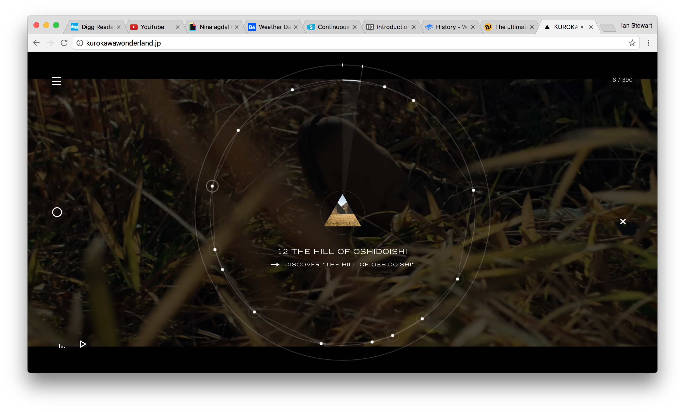
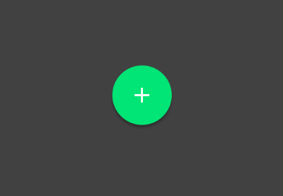
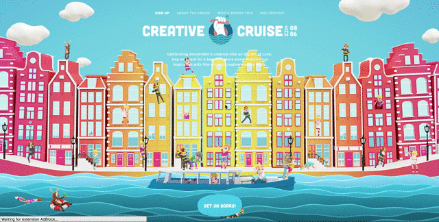
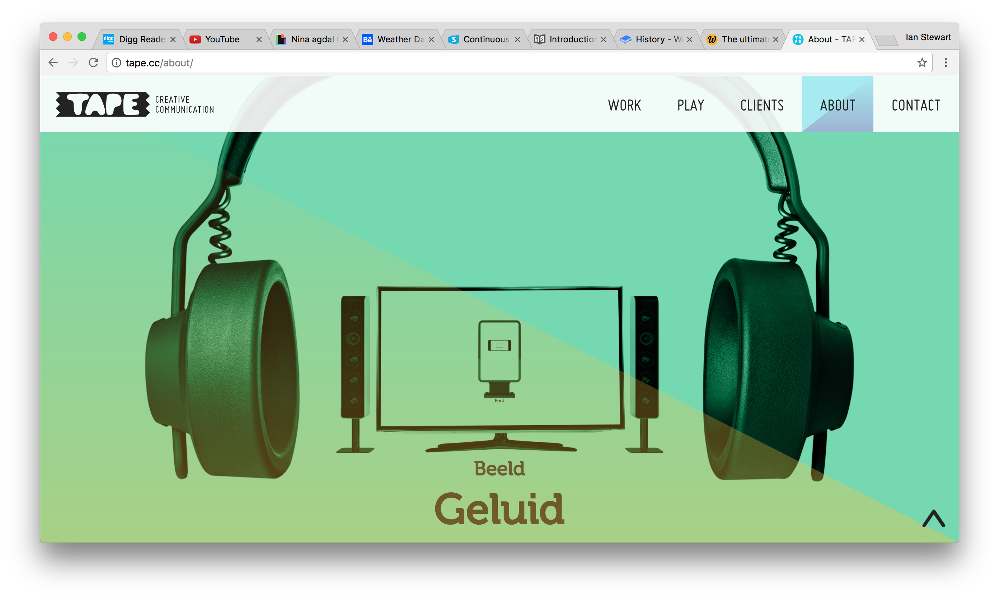
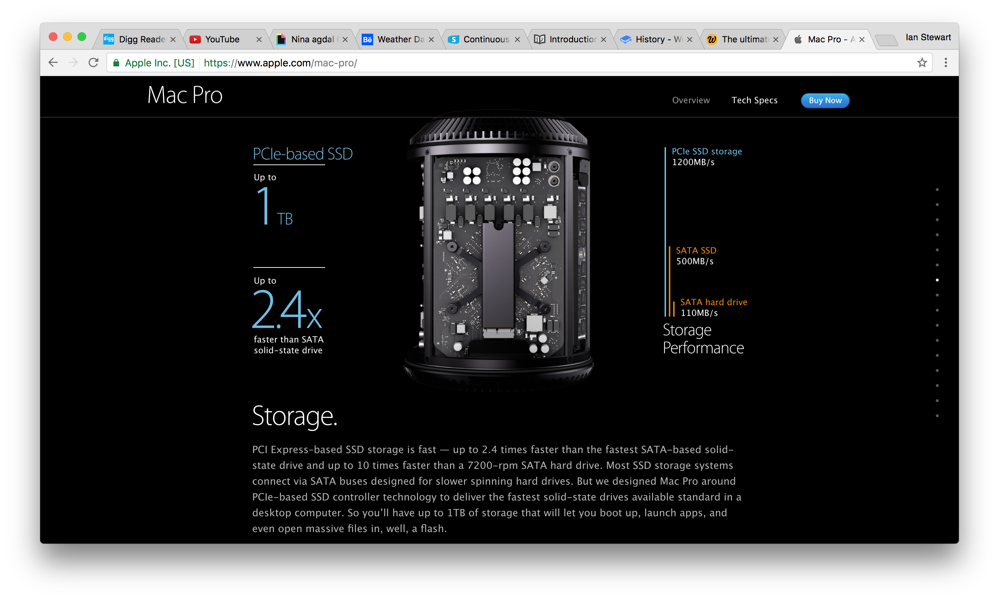
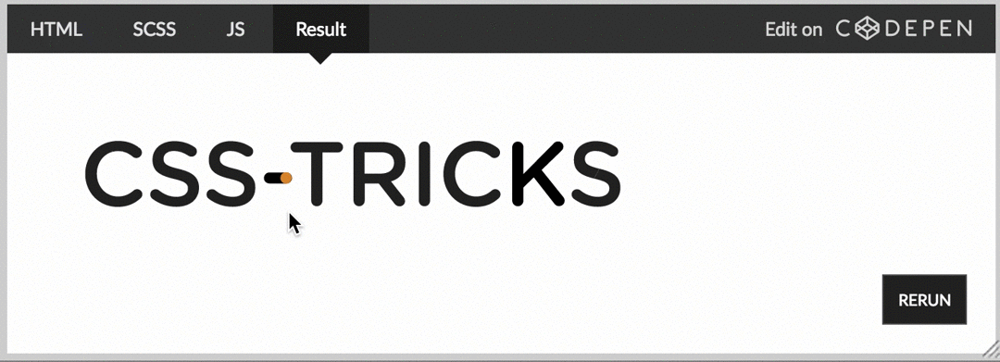
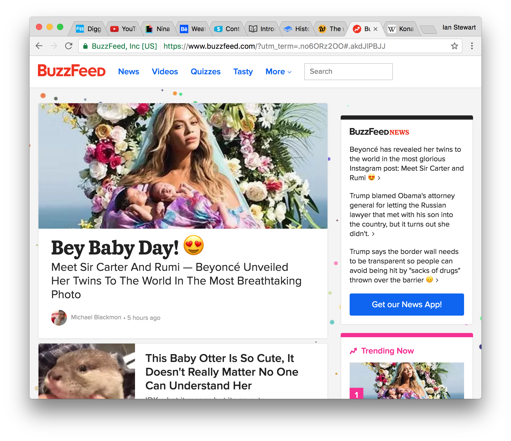

# Web animations
> Animation is no longer a novelty for web designers… it’s becoming the basis of effective interaction design.

## Types of web animations
Let’s get down to it. What kinds of animation are we talking about? I mean, u can use animation to enhance user interfaces. But what exactly does is that?

The way to go is obviously not to throw animation at your web page elements and hope it improves conversion rates.  Like every other aspect within design, what kinds of animation you use, and when you use animations, must be carefully considered. Let’s start by looking at some different types of animation typically used around the web:

* Interface Element Animation
* Loading Animations
* Telling Animations
* Decorative Animations

### Interface Element Animation
This might be the most common type of animation, and it should be. This is, probably, the most useful kind of animation that is available. This is the animation that lets a user know that their action (hovering, for example) has been registered. The hover was the starter needed to make something happen, whether that is revealing an image, lighting up text, adding depth to a ‘button’.

_Source: [kurokawa wonderland](http://kurokawawonderland.jp/)_

This kind of feedback isn’t only nice to have, it might even be essential, in this world of so called ‘flat’ design. Animating elements in simple, and subtle ways during interaction gives a user the feedback they need.

_Source: [Timeline-Based Animation for the Web with Hype 3](https://webdesign.tutsplus.com/tutorials/timeline-based-animation-for-the-web-with-hype-3--cms-24899)_

### Loading Animations
These are the kind of animations you’ll show a user when something’s happening in the background, and you don’t want them to freak out, while it takes a bit longer. The effects of these kind of animations was proven a while back, when interfaces were first invented. It all started with the way the mouse cursor would turn into an hour glass. Apple for example introduced the ‘spinning beach ball of death’ as we like to call it nowadays.

_Source: [The Best Loading Animations of 2017 – Awwwards – Medium](https://medium.com/@awwwards/the-best-loading-animations-of-2017-2d3a159e46f8)_

These ‘standards’ were adopted on the web as soon as this was possible. Like this users might even believe it actually goes faster. Either way, telling your user something is happening, even a simple spinning donut, can ease their mind. Even those who’ve been using computers a long time.

_Source: [Creative Cruise](http://creativecruise.nl/)_

### Telling Animations
The most common examples within this kind of animations are those pages that will show off a new product by ‘assembling’ it while you scroll. Others can have little characters following you down a page. Typically, these are not intended to improve usability. But more to impress the user, and give them some context. They might try to show off the features of a product, or the type of creation a company can make.

_Source: [About - TAPE Creative Communication](http://tape.cc/about/)_

An examples that probably everyone knows, comes from a brand that has a lot of experience within story telling; Apple. The info page for the Mac Pro shows you piece by piece as you scroll down.

_Source: [Mac Pro - Apple](https://www.apple.com/mac-pro/)_

### Decorative Animations
Some animations serve no purpose, besides being seen. Should you do this?… Yes, and no…

Decorative animations should be shown after people complete your call to action. You can see them as subtle animations that are only triggered once a user does something very specific, like hovering their mouse over something small in the header/footer. For example the old [CSS-Tricks](https://css-tricks.com/) site had an easter egg animation in their logo that can be called a decretive animation.

_Source: [CSS-Tricks](https://css-tricks.com/)_

Just Google search and find there are several sites where using the Konami code for instance will make something happen (like animation confetti).

_Source: [BuzzFeed](https://www.buzzfeed.com/?utm_term=.snxNRxWNN#.wuxa7kwaa)_
