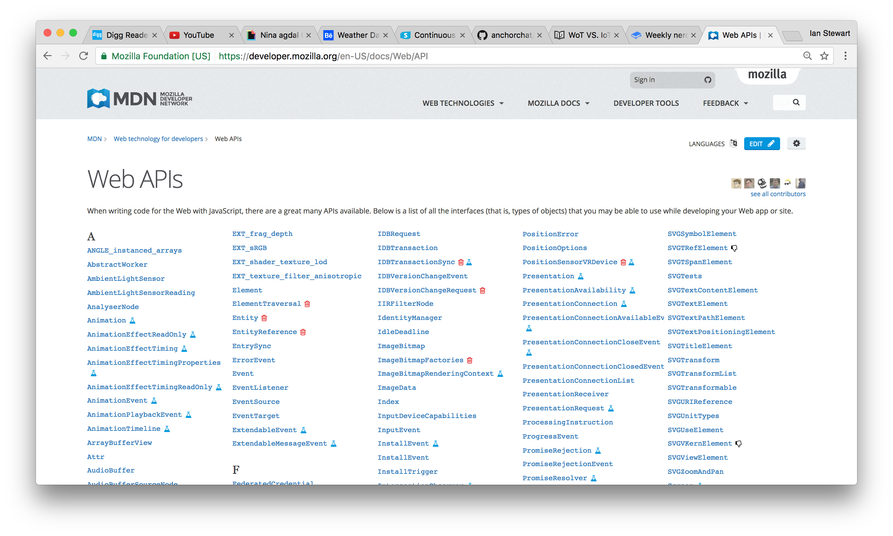

#  Web APIs

_Source: [Lewis Menelaws – Medium](https://medium.com/@LewisMenelaws)_

> The Web offers a wide variety of  application programming interfaces (APIs) to perform various useful tasks. These can be accessed using JavaScript code, and let you do anything from making minor adjustments to any window or element, to generating intricate graphical and audio effects using APIs such as WebGL and Web Audio. ~ [Web API reference - Web technology reference | MDN](https://developer.mozilla.org/en-US/docs/Web/Reference/API)

## The land off web APIs

There are 4 categories of APIs that can be used within the browser to do a variety off things. I will explain the 4 categories as found on [Mozilla Developer Network](https://developer.mozilla.org/en-US/).

### Document Object Model
The DOM is an API that allows access to and modification of the current document. It allows manipulation of document Node and Element. HTML, XML and SVG have extended it to manipulate their specific elements.

### Device APIs
This set of APIs allows access to various hardware features available to Web pages and applications. E.g. Ambient Light Sensor API, Battery Status API, Geolocation API, Pointer Lock API, Proximity API, Device Orientation API, Screen Orientation API, Vibration API.

### Communication APIs
These APIs let Web pages and applications communicate with other pages or devices. E.g. Network Information API, Web Notifications, Simple Push API.

### Data management APIs
User data can be stored and managed using this set of APIs. E.g. FileHandle API, IndexedDB.

In addition to these APIs that are available to any Web site or app, a set of more powerful Mozilla APIs are available to privileged and certified applications.

### Privileged APIs
A privileged application is an installed app that has been given specific rights by the user. Privileged APIs include: TCP Socket API, Contacts API, Device Storage API, Browser API, Camera API.

### Certified APIs
A certified application is a low-level application performing critical operations in an operating system like Firefox OS. Less privileged application interact with these applications using Web Activities.  Certified APIs include: Bluetooth API, Mobile Connection API, Network Stats API, Telephony, WebSMS, WiFi Information API, Power Management API, Settings API, Idle API, Permissions API, Time/Clock API.

## Pros of using web APIs
* APIs can help developers to write better programs, and help the community around the program as a whole because of the API infrastructure.
* The  APIs are public, which in it’s turn means there is a lot to find about bugs etc.
* It adds a layer of abstraction to the underlying code.
* APIs make developers more productive. You don’t start from scratch.
* APIs offer a standard way for web applications/ websites to access, cameras, audio & bluetooth.

## Cons of using web APIs
*  It adds a layer of abstraction to the underlying code.
* Not every browser will have every API in it. Older versions won’t have the Fetch API for example.

_find a full reference of web APIs at [Web APIs | MDN](https://developer.mozilla.org/en-US/docs/Web/API)_
