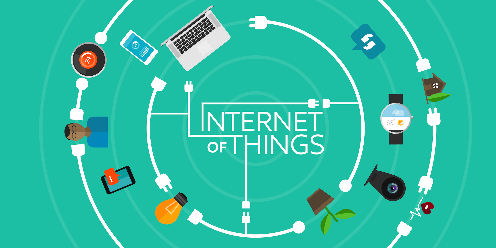
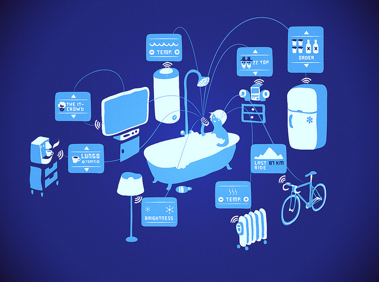
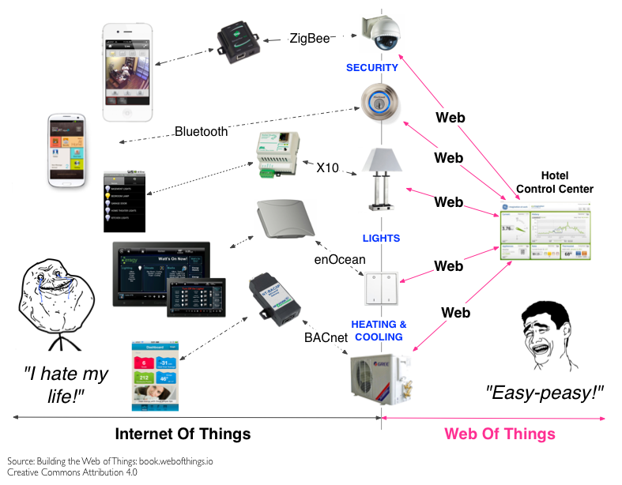

# WoT vs. IoT
## What is IoT?

_Source: [De impact van het Internet of Things | Business IT Rent](https://businessitrent.nl/de-impact-van-het-internet-of-things/)_

Simply put, this is the concept of basically connecting any device with an on and off switch to the Internet (and/or to each other). This includes everything from cellphones, coffee makers, washing machines, headphones, lamps, wearable devices and almost anything else you can think of. This also applies to components of machines. For example a jet engine of an airplane or the drill of an oil rig. As I mentioned, if it has an on and off switch then chances are it can be a part of the IoT.  The analyst firm Gartner says that by 2020 there will be over 26 billion connected devices... That's a lot of connections (some even estimate this number to be much higher, over 100 billion). The IoT is a giant network of connected 'things' (which also includes people). The relationship will be between people & people, people & things, and things & things.

## What is WoT?

_Source: [UK co EVRYTHNG and Samsung tie up on Web of Things - The Internet Of All Things](https://theinternetofallthings.com/uk-co-evrythng-samsung-tie-web-things-2014-10-31/)_

The Web of Things (WoT) is a computing concept that describes a future where everyday objects are fully integrated with the Web. The prerequisite for WoT is for the 'things' to have embedded computer systems that enable communication with the web. Such smart devices would then be able to communicate with each other using existing Web Standards.

Considered a subset of the Internet of Things (IoT), WoT focuses on software standards and frameworks such as REST, HTTP and URIs to create applications and services that combine and interact with a variety of network devices. So, you could think of the Web of Things as everyday objects being able to access web services.

## Key differences

The biggest difference between IoT and WoT is the way of communication between the devices. With WoT the communication is through a web interface directly to the appliances, where IoT communicates from an interface to a receiver and then to the appliances.

## Conclusion
Depending on the goal of your 'thing' or the level of experience you have in the field, you can consider the differences. And most of all start to love what WoT has to offer.
